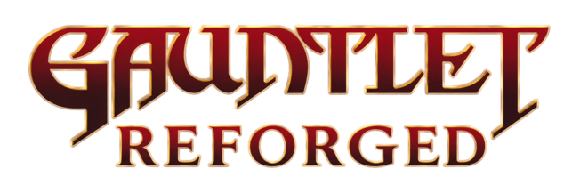

<h1 align="center">
  
</h1>


<p align="center"></p>

This is a fan-made homage to *Gauntlet*, the 1985 Atari Games coin-op that popularized
cooperative dungeon-crawling (Warrior, Valkyrie, Wizard, Elf, and all). Atari Games released the original; Midway Games later acquired Atari's assets and continued the series (*Gauntlet Legends*, etc.) through the late '90s and 2000s; and following Midway's 2009 bankruptcy, the *Gauntlet* IP passed to Warner Bros. Entertainment, managed today through Warner Bros. Interactive Entertainment. *Gauntlet* is listed by name among the acquired titles in [Schedule 2.1 of the May 20, 2009 Asset Purchase Agreement](https://www.sec.gov/Archives/edgar/data/1022080/000095012309009497/c51466exv2w1.htm) filed with the SEC.

This project is an unofficial re-implementation built from scratch in JavaScript, utilizing nothing more than HTML5 canvas. This project is not affiliated with, endorsed by, or built from assets owned by Atari, Midway, or Warner Bros. "Gauntlet Reforged," which is my own title, is used here descriptively, to credit the game this project is inspired by and to make it clear that this is not the original *Gauntlet*.

It's worth calling out that this is a partial implementation, not a full recreation of the arcade game. There are seven training levels that teach the mechanics, followed by ten dungeon levels, with a simple win screen after the last one. None of the later arcade sequels' features are here.

# 🕹️ Playing

Up to two players share the keyboard, plus one per connected gamepad.

| | Join | Move | Fire | Potion |
|---|---|---|---|---|
| **Player 1** | `1`–`4` | Arrow keys | `Space` | `Enter` |
| **Player 2** | `1`–`4` again, or `5`–`8` | `W` `A` `S` `D` | `F` | `G` |
| **Gamepad** | `A` `B` `X` `Y` | Stick or d-pad | `RB` | `LB` |

The number keys pick a **character** — `1` Warrior, `2` Valkyrie, `3` Wizard, `4` Elf —
and the game hands out whichever keyboard set is still free. So if the first player
takes the Warrior with `1`, a second player pressing `2` joins as the Valkyrie on
`WASD`. The `5`–`8` row claims the second control set explicitly, if you would rather
be deliberate about it. Players can join mid-run, not just from the menu.

`Esc` quits to the menu during play, and dismisses a help popup.

## Difficulty

Hard mode makes the monsters genuinely hunt you. Normally they walk at whichever
compass point the nearest player happens to be in, so a wall between you and them is
enough to leave them grinding into it. In hard mode everything except the ghost
follows a shared flow field — a breadth-first map of the true walking distance to the
nearest player — so they route around walls, come through doorways, and converge from
several directions at once.

Toggle it from the menu (the difficulty line under the play area); the choice is
remembered between sessions.

# 🛠️ Developer Options

## God mode

Type the Konami code — `↑` `↑` `↓` `↓` `←` `→` `←` `→` `B` `A` — at any point. There
is no prompt or announcement, just the same green glow a potion gives, to confirm it
landed. It is a toggle, so entering it again turns it back off.

It switches off both incoming damage and the automatic health drain (players normally
bleed 1 health every half second), which together are the same two switches as
`?nodamage=1&noautohurt=1`.

## URL flags

Append to the page URL, e.g. `?level=8&hard=1&potions=4`. Boolean flags accept
`1`, `true`, `y` or `yes`.

| Flag | Effect |
|---|---|
| `?hard=1` | Smart monster pathing (see Difficulty above) |
| `?level=N` | Boot straight into level `N` and start playing, skipping the menu. `0` is the test level, `1`–`7` the Training levels, `8`–`17` the Dungeons |
| `?player=NAME` | Which character `?level` starts you as: `warrior`, `valkyrie`, `wizard` or `elf`. Defaults to `warrior` |
| `?nodamage=1` | Monsters and their fire do no damage |
| `?noautohurt=1` | Stops the half-second health drain |
| `?nomonsters=1` | Suppresses monsters placed on the map (generators still spawn them) |
| `?nogenerators=1` | Suppresses monster generators |
| `?notreasure=1` | Suppresses every map pickup — gold, food, health, poison, potions **and keys**. Levels with locked doors become unfinishable, so pair it with `?keys=N` |
| `?potions=N` | Start each player with `N` potions |
| `?keys=N` | Start each player with `N` keys |
| `?reset=1` | Wipes saved progress, high score and difficulty on load |
| `?grid=1` | Draws the tile grid over the map |
| `?wall=N` | Force a wall tileset, `1`–`6` |
| `?floor=N` | Force a floor tileset, `1`–`9` |
| `?music=ID` | Force a track: `lostcorridors`, `bloodyhalo`, `citrinitas`, `fleshandsteel`, `mountingassault`, `phantomdrone`, `thebeginning`, `warbringer` |
| `?heap=1` | Logs JS heap usage to the console |

## Console helpers

The running game is exposed as `window.game`, so from the browser console:

```js
game.nextLevel();      // and game.prevLevel()
game.toggleHard();     // same as the menu toggle
game.debugGrid();      // toggle the tile grid
game.debugWall();      // cycle wall tilesets; pass true to cycle backwards
game.debugFloor();     // cycle floor tilesets; pass true to cycle backwards
game.resetLevel();     // clear the saved checkpoint, keep the high score
```

# 🏗️ Building

```bash
npm install
npm run dev       # vite dev server
npm run build     # regenerate bundles, then build for production
npm run preview   # serve the production build
```

## When you need to run the build script

The page loads three scripts, and only two of them are generated:

| Loaded by `index.html` | Comes from |
|---|---|
| `public/scripts/vendor.js` | **generated** from `public/scripts/game/vendor/` — `sizzle.js`, `animator.js`, `audio-fx.js`, `state-machine.js` |
| `public/scripts/game.js` | **generated** from `public/scripts/game/` — `base.js`, `game.js`, `pubsub.js`, `dom.js`, `key.js`, `gamepad.js`, `math.js` |
| `public/scripts/gauntlet.js` | **edited directly** — this is the game itself, and the build script never touches it |

So: **if you change anything under `public/scripts/game/` (including `vendor/`), regenerate the bundles.**

```bash
npm run build:engine
```

Changes to `public/scripts/gauntlet.js`, `index.html` or the stylesheet need no build step at all.

Two things worth knowing:

* **`npm run dev` does not rebuild the bundles.** Vite serves `public/` as-is, so edits to
  `public/scripts/game/**` will appear to do nothing until you rebuild. If you are working in
  there, run the watcher in a second terminal:

  ```bash
  node scripts/build.js --watch
  ```

* **The generated bundles are committed to the repository**, not ignored. Rebuild and commit
  `vendor.js` / `game.js` alongside the sources you changed, or the deployed game will run
  stale code.

# 🙏 Attributions

* All music is licensed, royalty-free, from [Lucky Lion Studios](http://luckylionstudios.com/) for the original project. That license has been extended to this project as well. If you re-use this project for your own purposes you must license your own music or negotiate to have the music apply to your project.

* All sound effects are licensed, royalty-free from [Premium Beat](https://www.premiumbeat.com/royalty-free-sfx) for the original project. That license has been extended to this project as well. If you re-use this project for your own purposes you must license your own sound effects or negotiate to have the sound effects apply to your project.

* Background tilesets (walls, floors, doors) are provided by [Open Game Art](http://opengameart.org/content/gauntlet-like-tiles), which have been placed in the public domain.

## 👨‍💻 Author

<p align="center">
  Made with 🤍 by <a href="https://github.com/jeffnyman">Jeff Nyman</a>
</p>

<p align="center">
  
</p>

<p align="center">
  <a href="https://testerstories.com" target="_blank" >
    
  </a>
</p>
<p align="center">
  <a href="https://www.linkedin.com/in/jeffnyman/" target="_blank" >
    
  </a>
</p>

## ☦️ Doxazein (δοξάζειν)

<p align="center">
  חֶסֶד וֶאֱמֶת אַל־יַעַזְבֻךָ קָשְׁרֵם עַל־גַּרְגְּרֹתֶיךָ כָּתְבֵם עַל־לוּחַ לִבֶּךָ
</p>

<p align="center">
"Let not mercy and truth forsake thee:<br>
bind them about thy neck;<br>
write them upon the table of thine heart."<br>
<em>Proverbs 3:3</em>
</p>

## ⚖️ License

The code used in this project is licensed under the [MIT license](https://github.com/jeffnyman/gauntlet-reforged/blob/main/LICENSE).

**Note:** The MIT license covers the original code in this repository only. It is not a license to the *Gauntlet* name or trademark, which belongs to Warner Bros. Entertainment and isn't granted by, or affiliated with, this project. It also doesn't extend to the licensed third-party music, sound effects, tilesets, and sprites listed above under Attributions, which remain under their own separate terms.

✨ Long live the classics.
